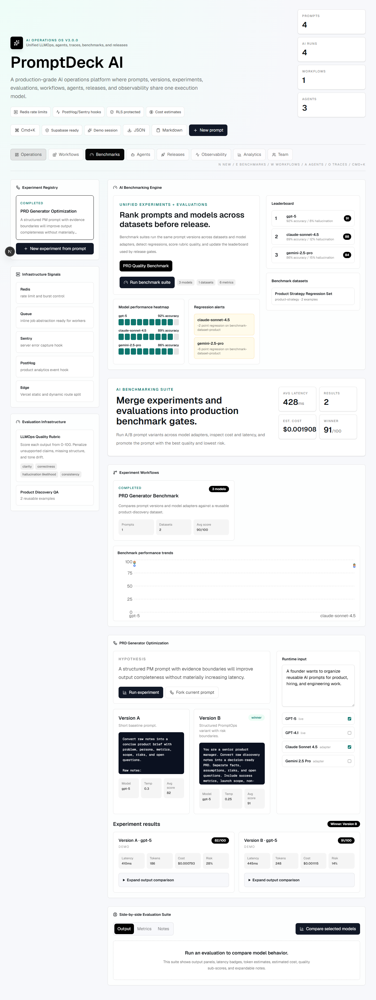
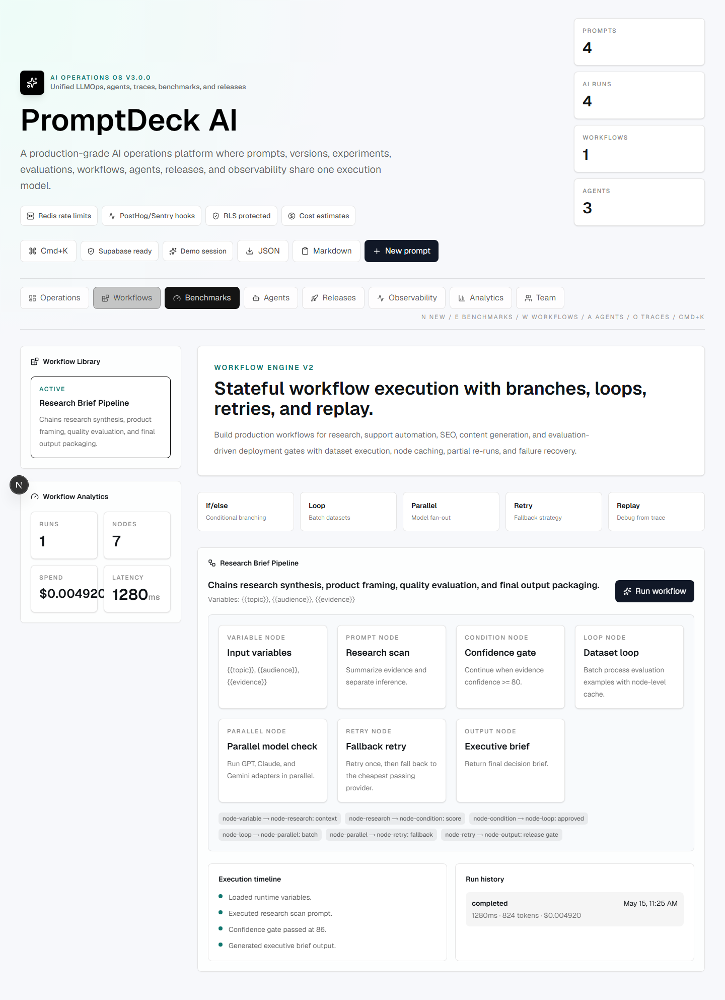
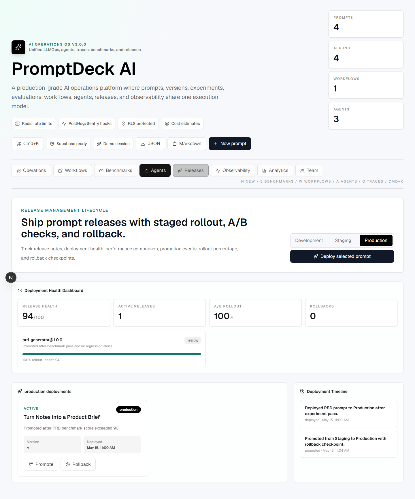
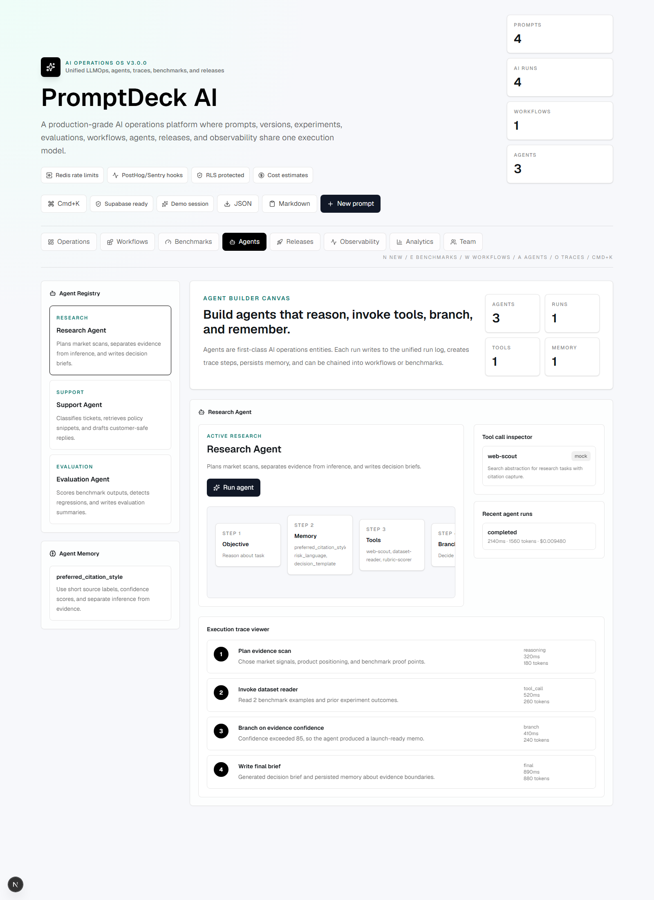
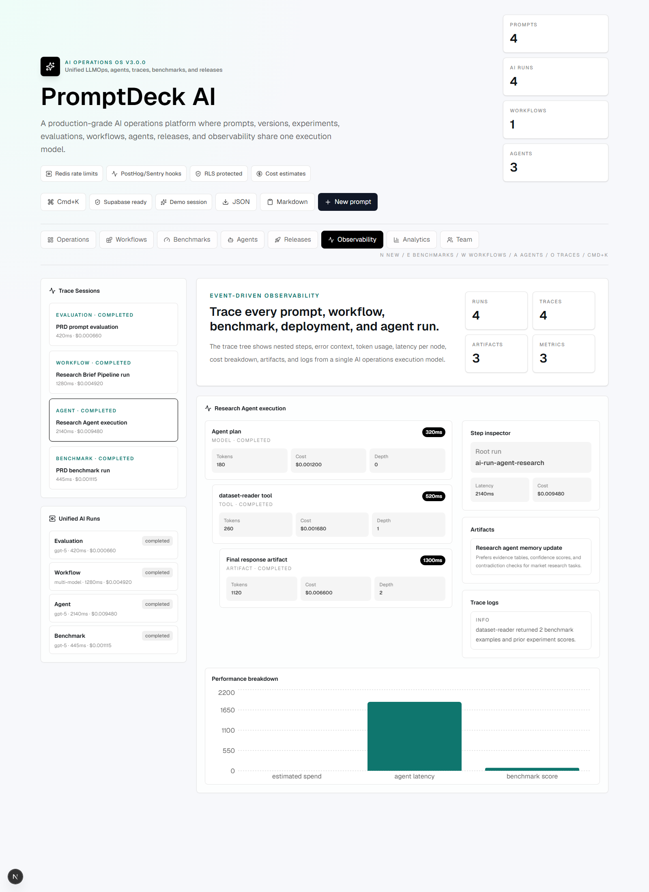

# PromptDeck AI v3.0 — AI Operations Platform

A production-grade AI operations platform for LLMOps, prompt lifecycle management, benchmarking, agents, workflows, releases, traces, observability, and enterprise AI operations.

PromptDeck AI v3.0 is built as the actual SaaS console, not a marketing landing page. It unifies prompts, versions, experiments, evaluations, workflows, deployments, observations, improvements, and agents under one execution model: `ai_runs`, `ai_artifacts`, `ai_metrics`, and trace sessions. Demo mode works without paid provider access, while Supabase persistence and RLS are ready for production credentials.

## Demo


## Screenshots

### PromptOps Console


### Experiments



### Workflow Studio



### Deployment Center



### Agent Builder



### Observability



### Mobile


### Shared Prompt


## Production Features

- AI Operations Platform release version: `3.0.0`
- Unified AI operations lifecycle: Prompt → Version → Experiment → Evaluation → Workflow → Deployment → Observation → Improvement
- Shared execution model with `ai_runs`, `ai_artifacts`, `ai_metrics`, `trace_sessions`, `trace_steps`, and `trace_logs`
- PromptOps command center with CRUD, search, filters, favorites, sharing, export, variables, health scoring, and Cmd+K actions
- AI Benchmarking Engine that merges experiments and evaluations into suites, datasets, runs, scores, leaderboards, heatmaps, and regression alerts
- First-class AI Agents with agent builder canvas, execution trace viewer, tool abstraction layer, memory viewer, and agent run history
- Workflow Engine v2 with condition, loop, retry/fallback, parallel, dataset-driven, replay-ready, and node-cache-ready concepts
- Release Management v2 for Development, Staging, and Production with staged rollout, A/B testing, release tags, health scores, and rollback actions
- Event-driven observability with trace trees, step inspector, artifacts, logs, token usage, latency, and cost per execution
- Full prompt versioning foundations with `prompt_versions`, automatic Supabase edit snapshots, local version notes, rollback, and git-style diffs
- Dynamic `{{variable}}` detection, generated input forms, validation, and live rendered prompt preview
- AI-assisted prompt optimization with structure, clarity, variable, and hallucination-risk suggestions
- Side-by-side model evaluation across GPT, Claude, and Gemini adapter abstractions
- Evaluation cards with output, metrics, notes, latency, token estimates, cost estimates, output length, and heuristic quality score
- Token and cost intelligence with input/output tokens, estimated USD spend, provider usage, cheapest provider, fastest provider, monthly token charts, and provider efficiency
- Global AI Operations dashboard with usage frequency, category usage, average latency, provider usage, token spend, trace counts, agent activity, and recent activity
- Organization, workspace, shared library, team role, invite, audit log, and activity feed foundations
- Server-only provider calls, Zod validation, protected live AI routes, RLS-first schema, and secure env handling
- Upstash Redis rate-limit integration with a local development fallback
- Observability hook layer for PostHog/Sentry-style server events
- OpenTelemetry-compatible telemetry extension point for evaluation spans
- Background job abstraction for future async evaluation queues
- Optimistic UI updates, pagination/load-more prompt browsing, and responsive SaaS UX

## Tech Stack

- Next.js `16.2.6` App Router
- React `19.2.6`
- Tailwind CSS `4.3.0`
- Supabase SSR helpers `0.10.3`
- Supabase JS `2.105.4`
- OpenAI Node SDK `6.38.0`
- Recharts
- Framer Motion
- Upstash Redis
- Zod `4.4.3`
- TypeScript
- Playwright
- Vercel

## AI Operations Lifecycle

```mermaid
flowchart LR
  Capture["Capture prompt idea"] --> Structure["Add variables and output contract"]
  Structure --> Version["Save version and changelog"]
  Version --> Experiment["Run experiments and benchmarks"]
  Experiment --> Evaluate["Evaluate model and dataset behavior"]
  Evaluate --> Workflow["Chain workflows or agents"]
  Workflow --> Deploy["Release to environments"]
  Deploy --> Observe["Trace cost, latency, quality, drift, errors"]
  Observe --> Improve["Improve prompt, agent, workflow, or release"]
  Improve --> Version
```



## Architecture

```mermaid
flowchart TD
  UI["Next.js App Router UI"] --> Local["Local demo workspace"]
  UI --> API["Protected API routes"]
  UI --> SupabaseClient["Supabase browser client"]
  API --> RateLimit["Upstash Redis rate limiter"]
  API --> Providers["AI provider adapter layer"]
  Providers --> OpenAI["OpenAI Responses API"]
  Providers --> Claude["Claude adapter"]
  Providers --> Gemini["Gemini adapter"]
  API --> Observability["Observability hooks"]
  SupabaseClient --> RLS["Supabase Postgres + RLS"]
  RLS --> UnifiedRuns["ai_runs + ai_artifacts + ai_metrics"]
  RLS --> Traces["trace_sessions + trace_steps + trace_logs"]
  RLS --> Agents["agents + agent_runs + agent_memory + agent_tools"]
  RLS --> Benchmarks["benchmark_suites + benchmark_runs + benchmark_scores"]
  RLS --> Versions["prompt_versions"]
  RLS --> Evaluations["prompt_evaluations"]
  RLS --> Experiments["prompt_experiments"]
  RLS --> OSExperiments["experiments + experiment_runs"]
  RLS --> Deployments["prompt_deployments + deployment_history"]
  RLS --> Workflows["ai_workflows + workflow_runs"]
  RLS --> Orgs["organizations + audit_logs"]
  RLS --> Workspaces["workspaces and collections"]
```



More diagrams live in [docs/ARCHITECTURE.md](docs/ARCHITECTURE.md).

## Database Schema

Migration files live in `supabase/migrations/` and should be applied in filename order.

Core tables:

- `profiles`
- `prompt_categories`
- `prompts`
- `prompt_runs`
- `prompt_versions`
- `prompt_evaluations`
- `prompt_experiments`
- `prompt_experiment_variants`
- `prompt_experiment_results`
- `experiments`
- `experiment_runs`
- `evaluation_datasets`
- `evaluation_presets`
- `prompt_deployments`
- `deployment_history`
- `ai_workflows`
- `workflow_runs`
- `organizations`
- `organization_members`
- `audit_logs`
- `prompt_activity`
- `workspaces`
- `workspace_members`
- `workspace_invites`
- `prompt_collections`
- `collection_prompts`
- `ai_runs`
- `ai_artifacts`
- `ai_metrics`
- `trace_sessions`
- `trace_steps`
- `trace_logs`
- `agents`
- `agent_runs`
- `agent_memory`
- `agent_tools`
- `benchmark_suites`
- `benchmark_datasets`
- `benchmark_runs`
- `benchmark_scores`
- `prompt_intelligence`
- `prompt_releases`

Scale-oriented indexes cover user dashboards, categories, favorites, tags, full-text search, public share slugs, prompt versions, evaluations, experiment runs, deployment history, workflow runs, agent runs, benchmark runs, trace sessions, trace steps, AI metrics, audit logs, activity timelines, and workspace membership.

See [docs/SUPABASE.md](docs/SUPABASE.md) for the RLS policy matrix and migration order.

## API Routes

```text
POST /api/test-prompt
POST /api/evaluate-prompt
POST /api/optimize-prompt
```

All routes validate payloads with Zod. Live provider calls require a Supabase session when Supabase and provider credentials are configured. Explicit demo mode returns deterministic demo responses without provider spend.

## Local Setup

```bash
npm install
npm run dev
```

Open:

```text
http://localhost:3000
```

Optional environment variables:

```bash
NEXT_PUBLIC_SUPABASE_URL=
NEXT_PUBLIC_SUPABASE_PUBLISHABLE_KEY=
NEXT_PUBLIC_SUPABASE_ANON_KEY=
OPENAI_API_KEY=
OPENAI_MODEL=gpt-5
UPSTASH_REDIS_REST_URL=
UPSTASH_REDIS_REST_TOKEN=
SENTRY_DSN=
POSTHOG_PROJECT_API_KEY=
POSTHOG_HOST=https://app.posthog.com
```

Use `.env.example` as the template. Real `.env*` files are ignored by Git.

## Verification

Commands run successfully:

```bash
npm run lint
npm run typecheck
npm run build
npm run test:e2e
npm audit --audit-level=moderate
```

Current audit result:

```text
found 0 vulnerabilities
```

Browser QA covers the demo auth path, prompt optimization, side-by-side evaluation, benchmarking engine, agent builder, workflow studio, release center, observability, analytics, team, and shared prompt route.

## Deployment

1. Create a Supabase project.
2. Apply all SQL migrations in filename order.
3. Configure Supabase Auth redirect URLs for local, preview, and production.
4. Create or link the Vercel project.
5. Add Production, Preview, and Development env vars in Vercel.
6. Deploy with Vercel.

Production URL:

```text
https://ai-prompt-management-platform.vercel.app
```

GitHub remote:

```text
https://github.com/obone410/AI-Prompt-Management-Platform.git
```

## Scaling To 1 Million Users

- Queries stay scoped by `user_id` and/or workspace membership.
- Prompt search uses trigger-maintained `tsvector` plus GIN index.
- Tags use a GIN index.
- Public sharing uses a partial unique index and slug-scoped RPC.
- Version history and evaluations are append-oriented and indexed by prompt/user.
- AI calls stay server-side for spend control, auth, rate limiting, and observability.
- Upstash Redis can enforce distributed rate limits across Vercel regions.
- The UI has a load-more pagination path and can move to cursor pagination for very large workspaces.
- Evaluation work uses an inline job abstraction today and can be moved to a queue without changing UI contracts.
- AI runs, trace steps, benchmark runs, agent runs, deployment history, workflow runs, and audit logs are append-oriented and can be partitioned or archived as volume grows.
- Provider usage summaries can be moved to warehouse-backed materialized views for very large workspaces.

## Recruiter Signals

- AI operations lifecycle, LLMOps, and PromptOps terminology
- CRUD, versioning, rollback, diffing, and audit history
- AI provider abstraction, agent architecture, trace observability, and benchmark/evaluation concepts
- Prompt deployment lifecycle and LLMOps release management
- AI workflow orchestration with node-based execution logs
- Token/cost intelligence and provider efficiency analytics
- Database schema design with RLS and indexes
- Secure server-side AI calls and environment handling
- Analytics, collaboration foundations, and production scaling story
