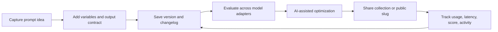
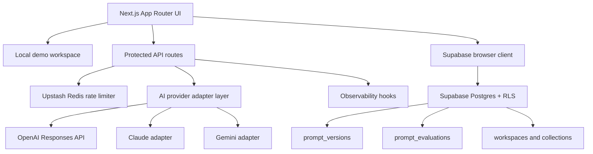

# PromptDeck AI — PromptOps Platform

A production-minded PromptOps platform for managing, versioning, testing, optimizing, sharing, and evaluating reusable AI prompts.

PromptDeck AI — PromptOps Platform is built as the actual SaaS console, not a marketing landing page. It runs in local demo mode without paid provider access, and it can persist prompts, versions, evaluations, categories, runs, and collaboration foundations to Supabase when production credentials and migrations are configured.

## Demo


## Screenshots

### PromptOps Console


### Mobile


### Shared Prompt


## Production Features

- PromptOps command center with CRUD, search, filters, favorites, sharing, export, and Cmd+K actions
- Full prompt versioning foundations with `prompt_versions`, automatic Supabase edit snapshots, local version notes, rollback, and git-style diffs
- Dynamic `{{variable}}` detection, generated input forms, validation, and live rendered prompt preview
- AI-assisted prompt optimization with structure, clarity, variable, and hallucination-risk suggestions
- Side-by-side model evaluation across GPT, Claude, and Gemini adapter abstractions
- Evaluation cards with output, metrics, notes, latency, token estimates, output length, and heuristic quality score
- Analytics dashboard with usage frequency, category usage, average latency, favorite prompt charts, and recent activity
- Workspace, shared collection, team role, ownership, and mock invite foundations
- Server-only provider calls, Zod validation, protected live AI routes, RLS-first schema, and secure env handling
- Upstash Redis rate-limit integration with a local development fallback
- Observability hook layer for PostHog/Sentry-style server events
- Background job abstraction for future async evaluation queues
- Optimistic UI updates, pagination/load-more prompt browsing, and responsive SaaS UX

## Tech Stack

- Next.js `16.2.6` App Router
- React `19.2.6`
- Tailwind CSS `4.3.0`
- Supabase SSR helpers `0.10.3`
- Supabase JS `2.105.4`
- OpenAI Node SDK `6.38.0`
- Recharts
- Framer Motion
- Upstash Redis
- Zod `4.4.3`
- TypeScript
- Playwright
- Vercel

## PromptOps Lifecycle



## Architecture



More diagrams live in [docs/ARCHITECTURE.md](docs/ARCHITECTURE.md).

## Database Schema

Migration files live in `supabase/migrations/` and should be applied in filename order.

Core tables:

- `profiles`
- `prompt_categories`
- `prompts`
- `prompt_runs`
- `prompt_versions`
- `prompt_evaluations`
- `prompt_activity`
- `workspaces`
- `workspace_members`
- `workspace_invites`
- `prompt_collections`
- `collection_prompts`

Scale-oriented indexes cover user dashboards, categories, favorites, tags, full-text search, public share slugs, prompt versions, evaluations, activity timelines, and workspace membership.

See [docs/SUPABASE.md](docs/SUPABASE.md) for the RLS policy matrix and migration order.

## API Routes

```text
POST /api/test-prompt
POST /api/evaluate-prompt
POST /api/optimize-prompt
```

All routes validate payloads with Zod. Live provider calls require a Supabase session when Supabase and provider credentials are configured. Explicit demo mode returns deterministic demo responses without provider spend.

## Local Setup

```bash
npm install
npm run dev
```

Open:

```text
http://localhost:3000
```

Optional environment variables:

```bash
NEXT_PUBLIC_SUPABASE_URL=
NEXT_PUBLIC_SUPABASE_PUBLISHABLE_KEY=
NEXT_PUBLIC_SUPABASE_ANON_KEY=
OPENAI_API_KEY=
OPENAI_MODEL=gpt-5
UPSTASH_REDIS_REST_URL=
UPSTASH_REDIS_REST_TOKEN=
SENTRY_DSN=
POSTHOG_PROJECT_API_KEY=
POSTHOG_HOST=https://app.posthog.com
```

Use `.env.example` as the template. Real `.env*` files are ignored by Git.

## Verification

Commands run successfully:

```bash
npm run lint
npm run typecheck
npm run build
npm run test:e2e
npm audit --audit-level=moderate
```

Current audit result:

```text
found 0 vulnerabilities
```

Browser QA covers the demo auth path, prompt optimization, side-by-side evaluation, analytics tab, team tab, and shared prompt route.

## Deployment

1. Create a Supabase project.
2. Apply all SQL migrations in filename order.
3. Configure Supabase Auth redirect URLs for local, preview, and production.
4. Create or link the Vercel project.
5. Add Production, Preview, and Development env vars in Vercel.
6. Deploy with Vercel.

Production URL:

```text
https://ai-prompt-management-platform.vercel.app
```

GitHub remote:

```text
https://github.com/obone410/AI-Prompt-Management-Platform.git
```

## Scaling To 1 Million Users

- Queries stay scoped by `user_id` and/or workspace membership.
- Prompt search uses generated `tsvector` plus GIN index.
- Tags use a GIN index.
- Public sharing uses a partial unique index and slug-scoped RPC.
- Version history and evaluations are append-oriented and indexed by prompt/user.
- AI calls stay server-side for spend control, auth, rate limiting, and observability.
- Upstash Redis can enforce distributed rate limits across Vercel regions.
- The UI has a load-more pagination path and can move to cursor pagination for very large workspaces.
- Evaluation work uses an inline job abstraction today and can be moved to a queue without changing UI contracts.

## Recruiter Signals

- Prompt engineering workflow and PromptOps terminology
- CRUD, versioning, rollback, diffing, and audit history
- AI provider abstraction and benchmark/evaluation concepts
- Database schema design with RLS and indexes
- Secure server-side AI calls and environment handling
- Analytics, collaboration foundations, and production scaling story
