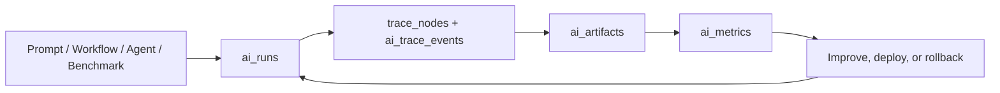

# PromptDeck AI v3.1 — AI Execution & Observability OS

PromptDeck AI is a production-style LLMOps workspace for managing the full AI execution lifecycle: prompts, versions, experiments, benchmarks, agents, workflows, deployments, traces, metrics, and improvements.

The project is built as a real SaaS console, not a landing page. It uses a unified execution backbone so every AI action becomes a run, every run creates trace data, and every output can be measured, compared, and improved.

Production: `https://ai-prompt-management-platform.vercel.app`

GitHub: `https://github.com/obone410/AI-Prompt-Management-Platform.git`

## Release State

Backend architecture is frozen for v3.1. The current pass focuses on product polish: cleaner frontend hierarchy, better responsive behavior, refreshed screenshots, tighter documentation, and clean deployment verification.

## Demo


## Screenshots

<p>
  
</p>

| Benchmarking Engine | Agent Runtime |
| --- | --- |
|  |  |

| Observability Center | Mobile Layout |
| --- | --- |
|  |  |

## What It Does

- Manages prompts with CRUD, categories, search, favorites, sharing, export, variables, and version history.
- Tests prompts through server-side AI routes with Zod validation, auth gating, and demo-safe fallback responses.
- Compares model outputs across GPT, Claude, and Gemini-style provider adapters.
- Runs dataset-driven benchmarks with quality, latency, token, cost, and regression metrics.
- Builds AI workflows with prompt, variable, condition, and output nodes.
- Tracks agents, tool calls, memory, run history, and execution traces.
- Deploys prompt releases across Development, Staging, and Production concepts.
- Provides a LangSmith-style observability center for trace trees, artifacts, logs, and performance breakdowns.
- Shows PromptOps analytics for usage, categories, cost estimates, provider efficiency, and recent activity.

## Architecture

PromptDeck AI uses one execution model across the product:



Key implementation points:

- `src/lib/ai-execution.ts` creates the shared run, trace, artifact, and metric payload shape.
- API routes keep provider calls server-side.
- Supabase migrations define RLS-first tables for prompts, versions, runs, traces, agents, benchmarks, workflows, organizations, and releases.
- Demo mode works without paid AI credentials, while production credentials stay in ignored env files or deployment secrets.

More detail:

- [Architecture](docs/ARCHITECTURE.md)
- [Supabase schema and RLS](docs/SUPABASE.md)
- [Security notes](SECURITY.md)
- [QA report](docs/QA.md)

## Tech Stack

- Next.js App Router `16.2.6`
- React `19.2.6`
- TypeScript
- Tailwind CSS
- Supabase
- OpenAI SDK
- Zod
- Upstash Redis
- Recharts
- Framer Motion
- Playwright
- Vercel

## Local Setup

```bash
npm install
npm run dev
```

Open `http://localhost:3000`.

Create `.env.local` from `.env.example` when using real services:

```bash
NEXT_PUBLIC_SUPABASE_URL=
NEXT_PUBLIC_SUPABASE_PUBLISHABLE_KEY=
NEXT_PUBLIC_SUPABASE_ANON_KEY=
OPENAI_API_KEY=
OPENAI_MODEL=gpt-5
UPSTASH_REDIS_REST_URL=
UPSTASH_REDIS_REST_TOKEN=
SENTRY_DSN=
POSTHOG_PROJECT_API_KEY=
```

Real `.env*` files are ignored by Git.

## Verification

Current verification suite:

```bash
npm run lint
npm run typecheck
npm run build
npm run test:e2e
npm audit --audit-level=moderate
```

The Playwright test covers the demo auth flow, prompt testing, and shared prompt route. Browser QA screenshots are stored in `docs/screenshots/`.

## Deployment

1. Create a Supabase project.
2. Apply SQL migrations from `supabase/migrations/` in filename order.
3. Configure Supabase Auth redirects for local, preview, and production.
4. Link the Vercel project.
5. Add environment variables in Vercel.
6. Deploy with `vercel deploy --prod`.

## Why This Project Is Recruiter-Friendly

PromptDeck AI demonstrates full-stack product engineering around a modern AI infrastructure problem:

- LLMOps and PromptOps system design
- Auth, RLS, CRUD, versioning, and audit trails
- Server-only AI provider calls
- Evaluation, benchmarking, tracing, and observability concepts
- Workflow and agent architecture
- Token/cost awareness and production scaling strategy
- Clean TypeScript, Next.js, Supabase, and Vercel delivery
