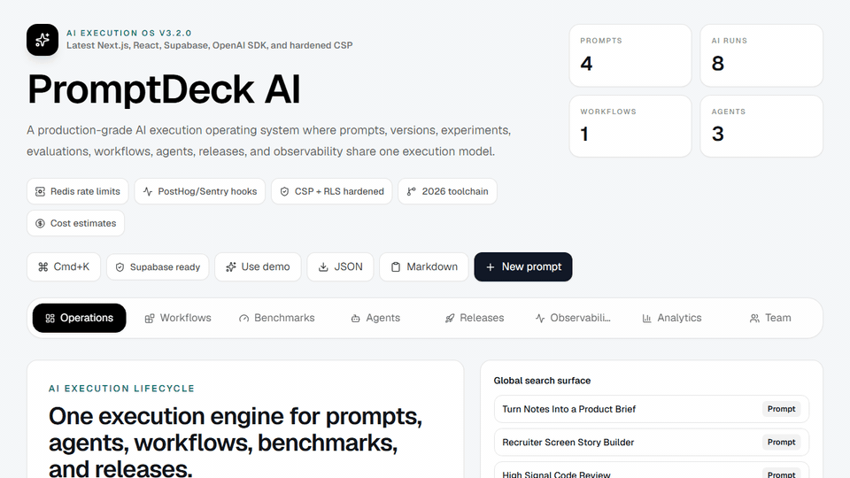
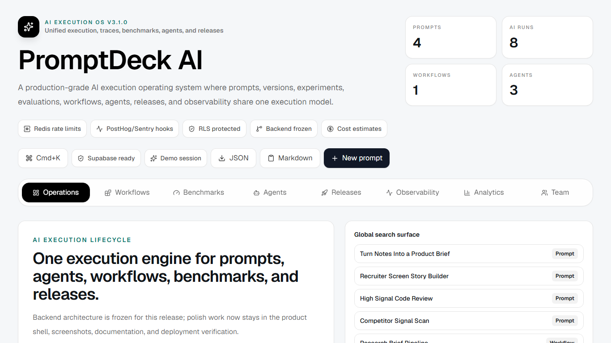
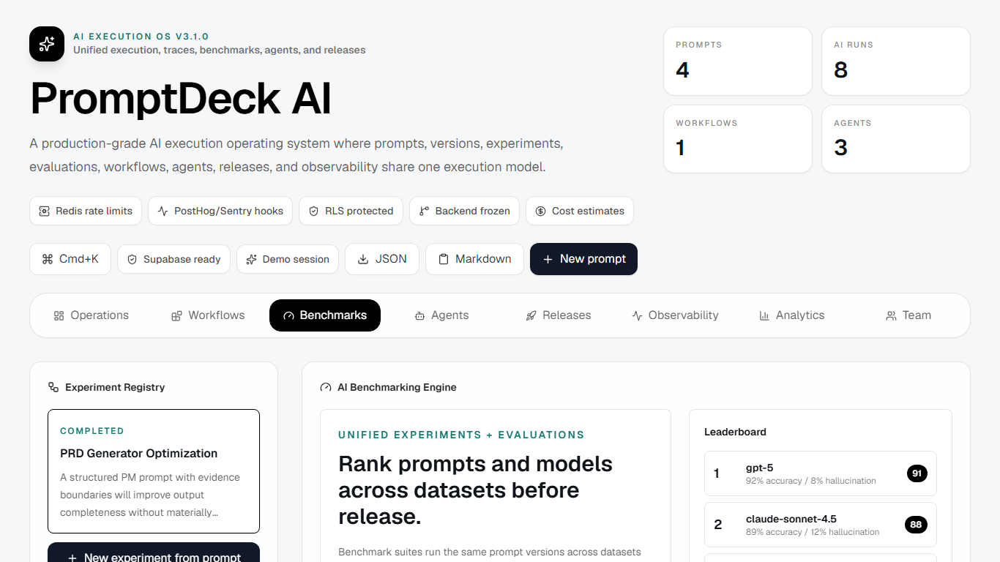
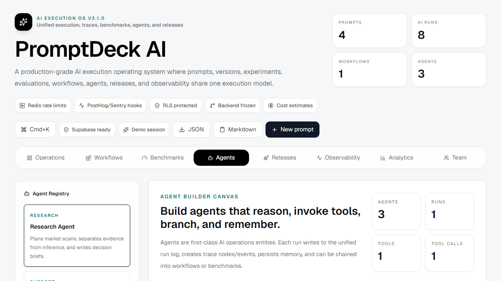
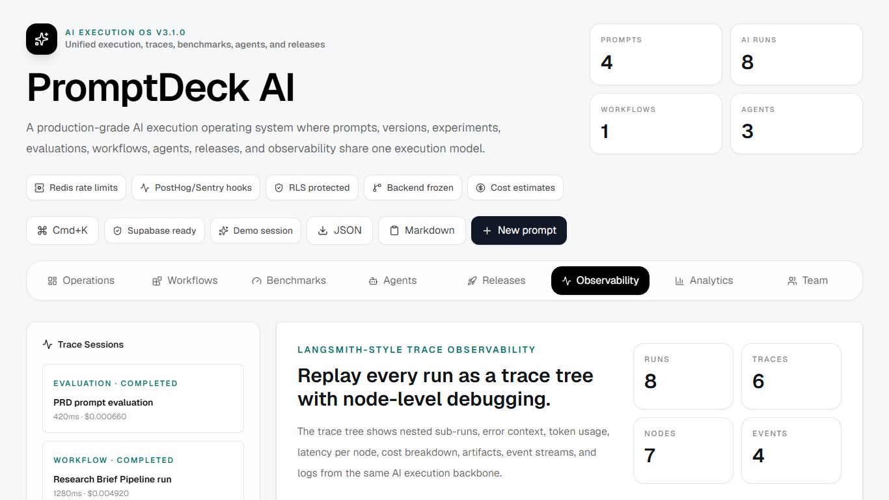
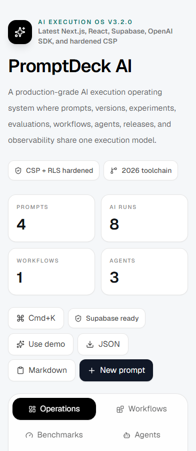
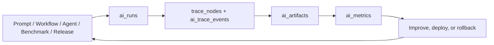

# PromptDeck AI v3.1

<div align="center">
  <p><strong>AI Execution & Observability OS for PromptOps, LLMOps, benchmarking, agents, workflows, and releases.</strong></p>
  <p>
    <a href="https://ai-prompt-management-platform.vercel.app">Live Production</a>
    ·
    <a href="docs/ARCHITECTURE.md">Architecture</a>
    ·
    <a href="docs/SUPABASE.md">Database & RLS</a>
    ·
    <a href="docs/QA.md">QA Report</a>
    ·
    <a href="SECURITY.md">Security</a>
  </p>
  <p>
    
    
    
    
    
  </p>
</div>

PromptDeck AI is a production-style SaaS console for the full AI operations lifecycle:

```text
Prompt -> Version -> Benchmark -> Workflow -> Agent -> Release -> Trace -> Improve
```

Instead of treating prompts, experiments, agents, workflows, and observability as separate tools, PromptDeck AI connects them through one execution backbone. Every AI action can become a run, every run can produce trace data, every output can become an artifact, and every artifact can be measured for latency, cost, quality, and reliability.

## Product Tour



## Screenshots

<p>
  
</p>

| Benchmarking Engine | Agent Runtime |
| --- | --- |
|  |  |

| Observability Center | Mobile Layout |
| --- | --- |
|  |  |

## Highlights

| Area | What It Includes |
| --- | --- |
| PromptOps | Prompt CRUD, categories, favorites, sharing, export, variables, version history, rollback, and improvement suggestions. |
| Benchmarking | Dataset-driven evaluations, model comparisons, quality scores, regression alerts, leaderboards, latency, token, and cost metrics. |
| Workflows | Prompt, variable, condition, and output nodes with run history, execution logs, and workflow analytics. |
| Agents | Agent builder, tool-call abstraction, memory view, run history, reasoning timeline, and trace inspection. |
| Releases | Development, staging, and production release concepts with rollout status, promotion, rollback, and deployment history. |
| Observability | Unified runs, trace events, artifacts, logs, error capture, performance breakdowns, and workspace-level analytics. |
| Collaboration | Organizations, workspaces, roles, shared libraries, team analytics, invite UI, audit logs, and activity feed foundations. |
| Security | RLS-first Supabase schema, server-only provider calls, Zod validation, protected APIs, rate limiting, and secure env handling. |

## Architecture

PromptDeck AI uses one execution model across the product:



Core implementation points:

- `src/lib/ai-execution.ts` defines the shared run, trace, artifact, and metric payloads.
- API routes keep OpenAI/provider calls on the server.
- Supabase migrations define RLS-first tables for prompts, versions, runs, traces, agents, benchmarks, workflows, organizations, and releases.
- Demo mode works without paid AI credentials, while production credentials stay in ignored env files or Vercel secrets.
- Upstash Redis, Sentry, PostHog, and observability hooks are represented as production-ready integration points.

## Tech Stack

| Layer | Tools |
| --- | --- |
| App | Next.js App Router `16.2.6`, React `19.2.6`, TypeScript |
| UI | Tailwind CSS, Framer Motion, Recharts, Lucide icons |
| Data | Supabase Auth, Postgres, RLS policies, SQL migrations |
| AI | OpenAI SDK with server-only provider routes and demo-safe fallbacks |
| Infra | Vercel, Upstash Redis rate limiting, Sentry/PostHog hooks |
| Quality | ESLint, TypeScript, Playwright, npm audit |

## Local Development

```bash
npm install
npm run dev
```

Open `http://localhost:3000`.

Create `.env.local` from `.env.example` when using live services:

```bash
NEXT_PUBLIC_SUPABASE_URL=
NEXT_PUBLIC_SUPABASE_PUBLISHABLE_KEY=
NEXT_PUBLIC_SUPABASE_ANON_KEY=
OPENAI_API_KEY=
OPENAI_MODEL=gpt-5
UPSTASH_REDIS_REST_URL=
UPSTASH_REDIS_REST_TOKEN=
SENTRY_DSN=
POSTHOG_PROJECT_API_KEY=
```

Real `.env*` files are ignored by Git.

## Verification

The project is checked with:

```bash
npm run lint
npm run typecheck
npm run build
npm run test:e2e
npm audit --audit-level=moderate
```

The Playwright test covers demo sign-in, prompt testing, benchmarking, agent execution, workflow execution, release controls, observability navigation, and the shared prompt route. Browser QA screenshots live in `docs/screenshots/`.

## Deployment

1. Create a Supabase project.
2. Apply SQL migrations from `supabase/migrations/` in filename order.
3. Configure Supabase Auth redirects for local, preview, and production.
4. Link the Vercel project.
5. Add environment variables in Vercel.
6. Deploy with `vercel deploy --prod`.

Production is currently served at:

```text
https://ai-prompt-management-platform.vercel.app
```

## Why Recruiters Like This Project

PromptDeck AI demonstrates more than a prompt CRUD app. It shows product and systems thinking around modern AI infrastructure:

- LLMOps and PromptOps architecture
- Auth, RLS, CRUD, versioning, audit trails, and team foundations
- Server-only AI provider execution with secure environment handling
- Benchmarking, evaluation, trace observability, and cost awareness
- Workflow and agent runtime concepts
- Clean TypeScript, Next.js, Supabase, and Vercel delivery

## Documentation

- [Architecture](docs/ARCHITECTURE.md)
- [Supabase schema and RLS](docs/SUPABASE.md)
- [Security notes](SECURITY.md)
- [QA report](docs/QA.md)
