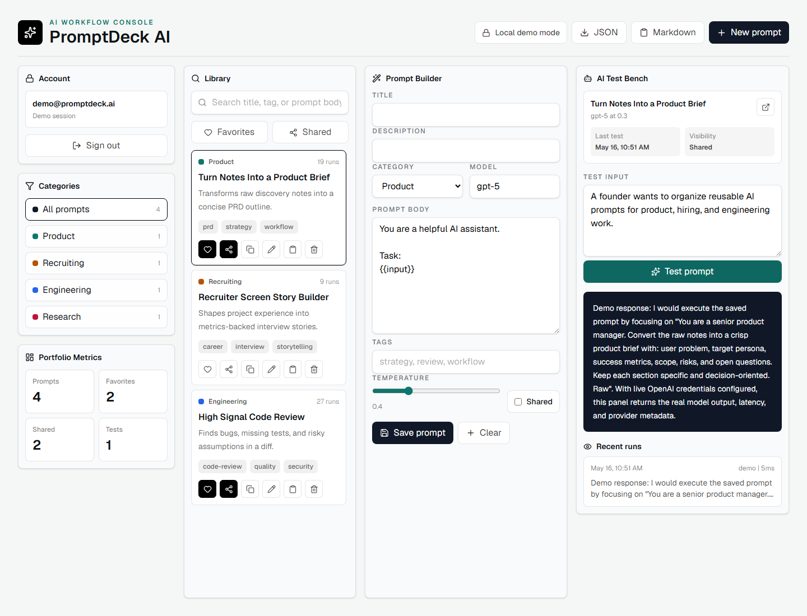
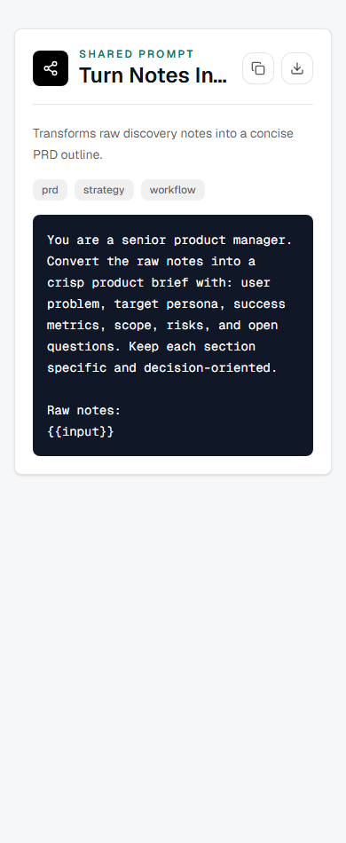

# PromptDeck AI

A recruiter-ready AI Prompt Management Platform for saving, categorizing, testing, sharing, favoriting, searching, and exporting reusable prompts.

PromptDeck AI is built as a real working console, not a landing page. It runs locally without external keys through demo mode, and it persists categories, prompts, and test runs to Supabase when production credentials are configured.

## Screenshots

### Dashboard



### Mobile


### Shared Prompt



## Features

- Authentication-ready account flow with Supabase support and local demo mode
- Prompt CRUD for creating, editing, duplicating, deleting, and organizing prompts
- Supabase-backed prompt/category/run persistence when configured
- Prompt categories with color-coded library filters
- Search across titles, descriptions, bodies, and tags
- Favorite prompts and shared prompt filters
- Public share links for prompts marked as shared
- AI test bench with prompt input, model settings, latency metadata, and run history
- Export filtered prompts to JSON or Markdown
- Responsive dashboard UI for desktop and mobile
- Supabase SQL migration with indexes, triggers, constraints, and RLS policies
- Slug-scoped public prompt RPC for safer sharing
- Playwright e2e coverage for the core demo workflow

## Tech Stack

- Next.js `16.2.6` App Router
- React `19.2.4`
- Tailwind CSS `4.3.0`
- Supabase SSR helpers `0.10.3`
- Supabase JS `2.105.4`
- OpenAI Node SDK `6.37.0`
- Zod `4.4.3`
- Lucide React icons
- Playwright for local browser verification
- Vercel-ready deployment configuration

## Prompt Engineering Workflow

PromptDeck models prompts as reusable workflow assets. Each prompt stores:

- The actual prompt body, including `{{input}}` placeholders
- Category and tags for retrieval
- Model and temperature settings
- Favorite and sharing state
- Usage count and last tested timestamp
- Test run history with model, provider, output, and latency

This makes the app useful for AI-heavy teams that need repeatable prompt operations instead of scattered notes.

## Database Schema

The Supabase migration lives in:

```text
supabase/migrations/
```

Tables:

- `profiles`: user profile attached to Supabase Auth
- `prompt_categories`: user-owned prompt categories
- `prompts`: prompt content, tags, favorite/share state, model settings, and search vector
- `prompt_runs`: AI test history for each prompt

Scale-oriented indexes include:

- `prompts_user_updated_idx`
- `prompts_user_category_idx`
- `prompts_user_favorite_idx`
- `prompts_public_share_slug_idx`
- `prompts_tags_idx`
- `prompts_search_document_idx`
- `prompt_runs_user_created_idx`

Row Level Security is enabled on every user data table.
See `docs/SUPABASE.md` for the policy matrix, migration order, and public sharing RPC.

## AI Testing Logic

The test bench calls:

```text
POST /api/test-prompt
```

The route validates input with Zod, rate-limits local requests, keeps `OPENAI_API_KEY` server-only, and uses the OpenAI Responses API when credentials exist.

If no OpenAI key is configured, the route returns a deterministic demo response so the project can still be reviewed locally.

## Local Setup

```bash
npm install
npm run dev
```

Open:

```text
http://localhost:3000
```

Optional environment variables:

```bash
NEXT_PUBLIC_SUPABASE_URL=
NEXT_PUBLIC_SUPABASE_PUBLISHABLE_KEY=
OPENAI_API_KEY=
OPENAI_MODEL=gpt-5
```

Use `.env.example` as the template. Real `.env*` files are ignored by Git.

## Verification

Commands run successfully:

```bash
npm run lint
npm run typecheck
npm run build
npm run test:e2e
npm audit --audit-level=moderate
```

Current security audit result:

```text
found 0 vulnerabilities
```

The project also includes `SECURITY.md` with implemented checks and production hardening notes.

## Deployment Process

1. Create a Supabase project.
2. Apply `supabase/migrations/202605150001_initial_promptdeck_schema.sql`.
3. Configure Supabase Auth redirect URLs for local, preview, and production.
4. Create a Vercel project from this repository.
5. Add environment variables in Vercel:
   - `NEXT_PUBLIC_SUPABASE_URL`
   - `NEXT_PUBLIC_SUPABASE_PUBLISHABLE_KEY`
   - `OPENAI_API_KEY`
   - `OPENAI_MODEL`
6. Deploy with Vercel.

## Designing For 1 Million Users

The current implementation is designed so the next production steps are straightforward:

- Every database query can be scoped by `user_id`.
- Search is backed by a generated `tsvector` and GIN index.
- Tags use a GIN index.
- Public sharing uses a partial unique index.
- Prompt runs are append-only and indexed by prompt and user.
- AI calls happen server-side for central cost control and rate limiting.
- Cursor pagination can be added before exposing very large workspaces.
- A durable rate limiter should replace the local in-memory limiter for production.

## Lessons Learned

- Prompt management works best when prompts are treated like operational assets: categorized, tested, version-aware, and exportable.
- A local demo mode makes recruiter review much easier without weakening the production Supabase/OpenAI integration points.
- Security posture matters even in portfolio projects: hidden secrets, server-only AI calls, RLS, validation, and audit checks all make the project more credible.
- Responsive dashboard design needs dense, scannable UI more than a marketing-style hero page.
