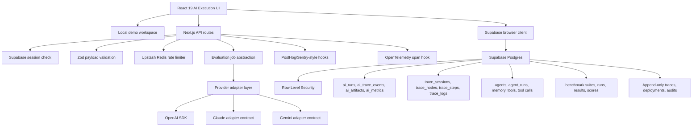
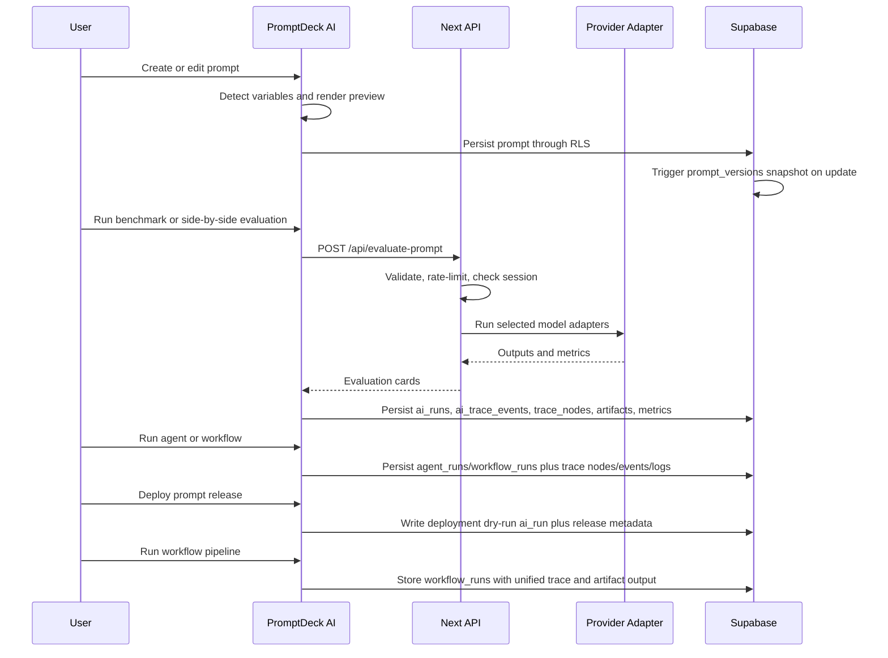
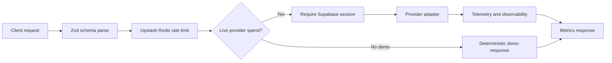

# PromptDeck AI v3.2 — AI Execution & Observability OS Architecture

PromptDeck AI v3.2 positions prompt work as a unified AI execution lifecycle: every prompt test, evaluation, experiment, workflow, agent run, benchmark, optimization, and deployment dry run becomes an `ai_run` with trace nodes, trace events, artifacts, and normalized metrics.

## Product Surface

- PromptOps console: CRUD, search, favorites, sharing, export, variables, and versioning
- AI Execution command center: lifecycle metrics, global search, prompt health, top runs, and global controls
- AI Benchmarking Engine: benchmark suites, datasets, benchmark runs/results, scores, leaderboards, heatmaps, and regression alerts
- Agents: first-class research/support/coding/data-extraction/evaluation agents with tools, memory, tool-call logs, and execution traces
- Releases: Development/Staging/Production promotion, staged rollout, A/B testing, rollback, health, and release metadata
- Workflow Engine v2: prompt, variable, condition, loop, parallel, retry, and output nodes with execution timeline and run logs
- Observability: unified runs, artifacts, metrics, trace sessions, trace nodes, trace events, trace logs, replay timeline, and step inspector
- AI evaluation suite: test prompts, compare model adapters, inspect metrics, and optimize prompts
- Analytics: provider efficiency, token usage, estimated spend, cheapest provider, fastest provider, latency, and activity timelines
- Team foundations: organizations, workspaces, members, roles, invites, shared collections, and audit logs

## Runtime Architecture

## AI Execution Lifecycle

## ERD

```mermaid
erDiagram
  profiles ||--o{ prompt_categories : owns
  profiles ||--o{ prompts : owns
  profiles ||--o{ prompt_runs : records
  profiles ||--o{ prompt_versions : snapshots
  profiles ||--o{ prompt_evaluations : evaluates
  profiles ||--o{ prompt_experiments : owns
  profiles ||--o{ experiments : creates
  profiles ||--o{ prompt_deployments : deploys
  profiles ||--o{ ai_workflows : owns
  profiles ||--o{ ai_runs : executes
  profiles ||--o{ agents : owns
  profiles ||--o{ benchmark_suites : owns
  profiles ||--o{ trace_sessions : observes
  profiles ||--o{ organizations : owns
  profiles ||--o{ workspaces : owns
  organizations ||--o{ organization_members : includes
  organizations ||--o{ audit_logs : records
  workspaces ||--o{ workspace_members : includes
  workspaces ||--o{ workspace_invites : invites
  workspaces ||--o{ prompt_collections : groups
  prompt_categories ||--o{ prompts : categorizes
  prompts ||--o{ prompt_versions : versions
  prompts ||--o{ prompt_runs : tests
  prompts ||--o{ prompt_evaluations : benchmarks
  prompts ||--o{ prompt_experiments : experiments
  prompt_experiments ||--o{ prompt_experiment_variants : compares
  prompt_experiment_variants ||--o{ prompt_experiment_results : produces
  experiments ||--o{ experiment_runs : benchmarks
  prompts ||--o{ prompt_deployments : releases
  prompt_deployments ||--o{ deployment_history : logs
  prompt_deployments ||--o{ prompt_releases : tags
  ai_workflows ||--o{ workflow_runs : executes
  ai_runs ||--o{ ai_trace_events : events
  ai_runs ||--o{ ai_artifacts : emits
  ai_runs ||--o{ ai_metrics : measures
  trace_sessions ||--o{ trace_nodes : contains
  trace_sessions ||--o{ ai_trace_events : streams
  trace_sessions ||--o{ trace_steps : compatibility
  trace_sessions ||--o{ trace_logs : logs
  agents ||--o{ agent_runs : executes
  agent_runs ||--o{ agent_tool_calls : invokes
  agents ||--o{ agent_memory : remembers
  agents ||--o{ agent_tools : invokes
  benchmark_suites ||--o{ benchmark_runs : executes
  benchmark_runs ||--o{ benchmark_results : outputs
  benchmark_runs ||--o{ benchmark_scores : scores
  prompt_collections ||--o{ collection_prompts : contains
  prompts ||--o{ collection_prompts : listed
```

## API Flow

## Security Posture

- Provider calls happen only in server routes.
- OpenAI key is never exposed through `NEXT_PUBLIC_*`.
- Supabase browser keys are public by design and protected by RLS.
- Live provider spend requires a Supabase session.
- Prompt/evaluation payloads are validated with Zod.
- Evaluation responses include estimated input tokens, output tokens, output length, latency, quality sub-scores, and estimated cost.
- Deployment, workflow, organization, experiment, and audit tables use RLS with owner/member access checks.
- Unified run, trace-event, trace-node, artifact, metric, agent, benchmark, prompt-intelligence, and release tables use RLS with actor/workspace access checks.
- Production responses set CSP, HSTS, X-Frame-Options, nosniff, Referrer-Policy, Permissions-Policy, COOP, CORP, and origin isolation headers.
- New AI operations tables include RLS policies for actor/member access.

## Scaling Notes

- Dashboard queries remain scoped by `user_id` or workspace membership.
- Prompt search uses generated full-text vectors and GIN indexes.
- Prompt versions, evaluations, experiment results, AI runs, trace events, trace nodes, benchmark results, agent tool calls, deployment history, workflow runs, and audit logs are append-oriented for auditability.
- Upstash Redis rate limits work across serverless regions.
- Background job abstraction can be swapped from inline execution to queue workers.
- Experiment result tables are separated from variants so high-volume benchmark history can be paginated, archived, or moved to warehouse storage.
- Deployment environments are modeled separately from prompt content so releases can roll back without rewriting prompt history.
- Workflow run logs are stored separately from workflow definitions so execution history can scale independently.
- `ai_runs`, `ai_trace_events`, and `trace_nodes` are the partitioning-ready execution event stream for high-volume AI workloads.
- Large workspaces should move from load-more UI to cursor pagination backed by `(workspace_id, updated_at, id)` indexes.
