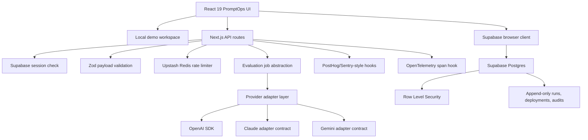
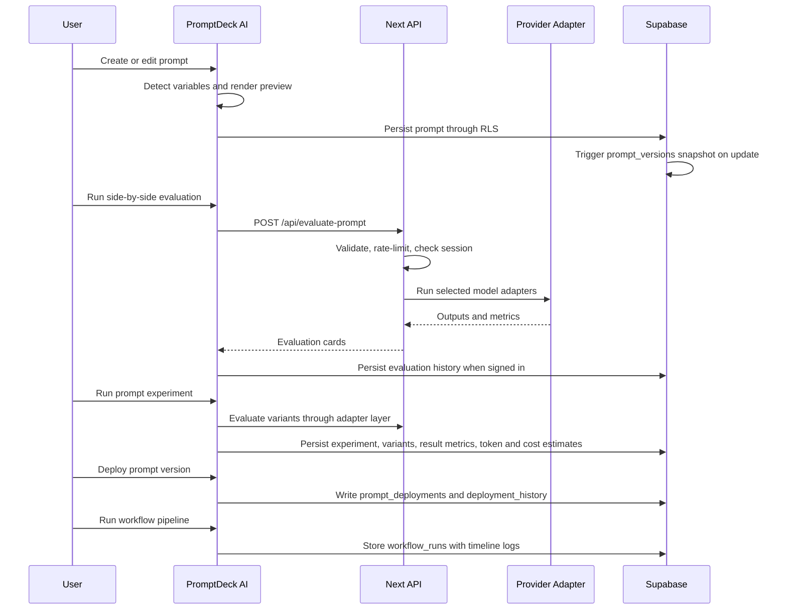
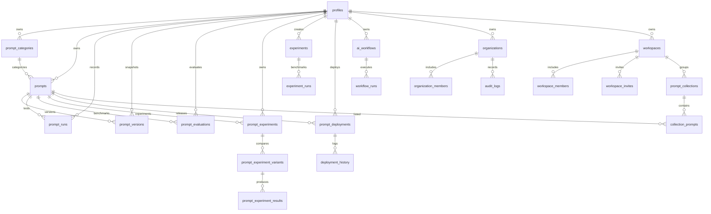
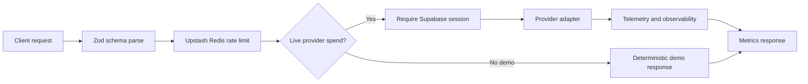

# PromptDeck AI v2.0 — AI Workflow Operating System Architecture

PromptDeck AI v2.0 positions prompt work as AI workflow infrastructure: teams capture prompt lifecycle changes, run LLMOps experiments, evaluate model behavior, deploy prompt versions across environments, orchestrate workflow pipelines, and observe usage, cost, quality, and latency.

## Product Surface

- PromptOps console: CRUD, search, favorites, sharing, export, variables, and versioning
- Experiments: compare prompt variants, inspect winners, review expandable outputs, and track latency/token/cost tradeoffs
- Experiment workflows: reusable datasets, scoring presets, status lifecycle, aggregate metrics, and benchmark history
- Deployments: Development/Staging/Production promotion, rollback, deployment logs, and release metadata
- Workflow Studio: prompt, variable, condition, and output nodes with execution timeline and run logs
- AI evaluation suite: test prompts, compare model adapters, inspect metrics, and optimize prompts
- Analytics: provider efficiency, token usage, estimated spend, cheapest provider, fastest provider, latency, and activity timelines
- Team foundations: organizations, workspaces, members, roles, invites, shared collections, and audit logs

## Runtime Architecture

## PromptOps Lifecycle

## ERD

## API Flow

## Security Posture

- Provider calls happen only in server routes.
- OpenAI key is never exposed through `NEXT_PUBLIC_*`.
- Supabase browser keys are public by design and protected by RLS.
- Live provider spend requires a Supabase session.
- Prompt/evaluation payloads are validated with Zod.
- Evaluation responses include estimated input tokens, output tokens, output length, latency, quality sub-scores, and estimated cost.
- Deployment, workflow, organization, experiment, and audit tables use RLS with owner/member access checks.
- Production responses set CSP, HSTS, X-Frame-Options, nosniff, Referrer-Policy, Permissions-Policy, and COOP.
- New PromptOps tables include RLS policies for owner/member access.

## Scaling Notes

- Dashboard queries remain scoped by `user_id` or workspace membership.
- Prompt search uses generated full-text vectors and GIN indexes.
- Prompt versions, evaluations, and experiment results are append-oriented for auditability.
- Experiment runs, deployment history, workflow runs, and audit logs are append-oriented for auditability.
- Upstash Redis rate limits work across serverless regions.
- Background job abstraction can be swapped from inline execution to queue workers.
- Experiment result tables are separated from variants so high-volume benchmark history can be paginated, archived, or moved to warehouse storage.
- Deployment environments are modeled separately from prompt content so releases can roll back without rewriting prompt history.
- Workflow run logs are stored separately from workflow definitions so execution history can scale independently.
- Large workspaces should move from load-more UI to cursor pagination backed by `(workspace_id, updated_at, id)` indexes.
