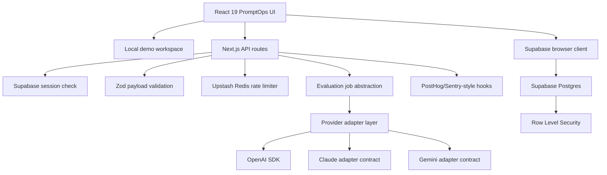
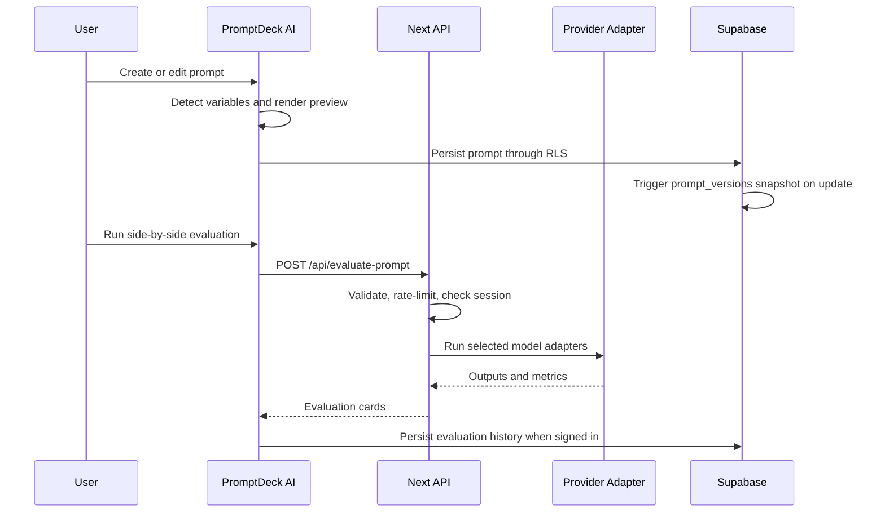
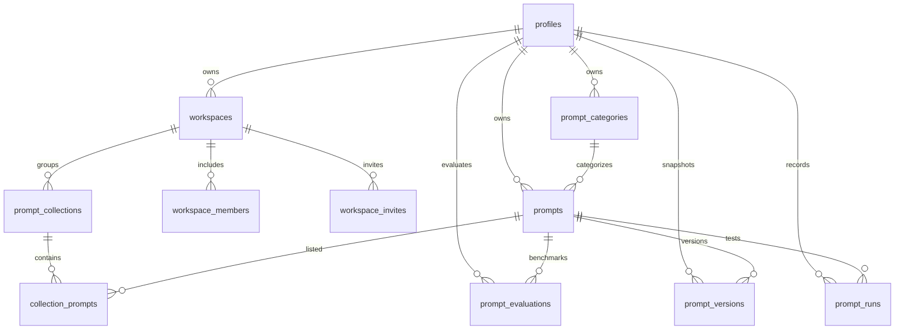
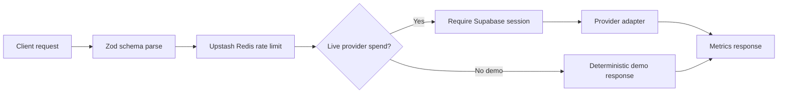

# PromptDeck AI — PromptOps Platform Architecture

PromptDeck AI — PromptOps Platform positions prompt management as AI workflow infrastructure: teams capture prompts, manage variables, version changes, run evaluations, optimize prompt quality, share collections, and observe usage.

## Product Surface

- PromptOps console: CRUD, search, favorites, sharing, export, variables, and versioning
- AI Lab: test prompts, compare model adapters, inspect metrics, and optimize prompts
- Analytics: category usage, frequency, latency, favorites, and activity timelines
- Team foundations: workspaces, members, roles, invites, and shared collections

## Runtime Architecture

## PromptOps Lifecycle

## ERD

## API Flow

## Security Posture

- Provider calls happen only in server routes.
- OpenAI key is never exposed through `NEXT_PUBLIC_*`.
- Supabase browser keys are public by design and protected by RLS.
- Live provider spend requires a Supabase session.
- Prompt/evaluation payloads are validated with Zod.
- Production responses set CSP, HSTS, X-Frame-Options, nosniff, Referrer-Policy, Permissions-Policy, and COOP.
- New PromptOps tables include RLS policies for owner/member access.

## Scaling Notes

- Dashboard queries remain scoped by `user_id` or workspace membership.
- Prompt search uses generated full-text vectors and GIN indexes.
- Prompt versions and evaluations are append-oriented for auditability.
- Upstash Redis rate limits work across serverless regions.
- Background job abstraction can be swapped from inline execution to queue workers.
- Large workspaces should move from load-more UI to cursor pagination backed by `(workspace_id, updated_at, id)` indexes.
